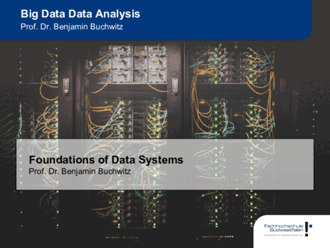

# Big Data: Systems and Methods

```{r, echo = F, out.width="80%", fig.cap="[Download Slides](slides/CH01-BDSM-Reliability,Scalability,Maintainability.pdf)"}

```


| No.  | Topic              | Slides    |
| ---: | :--------         | :---:     |
| 1    | Foundations of Data Systems   | [PDF](slides/CH01-BDSM-Reliability,Scalability,Maintainability.pdf)     |


[PDF](exercises/IMP.pdf)